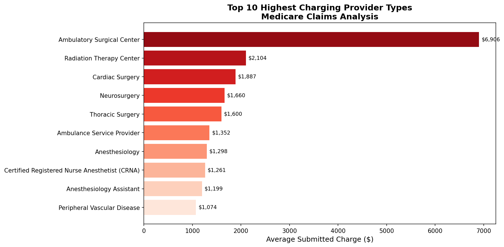
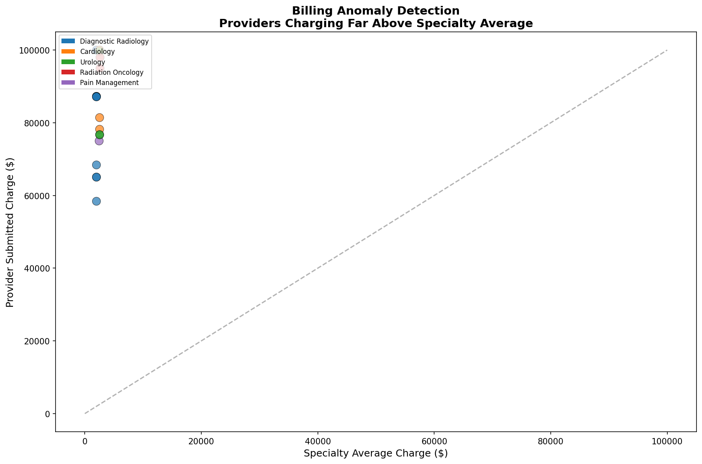
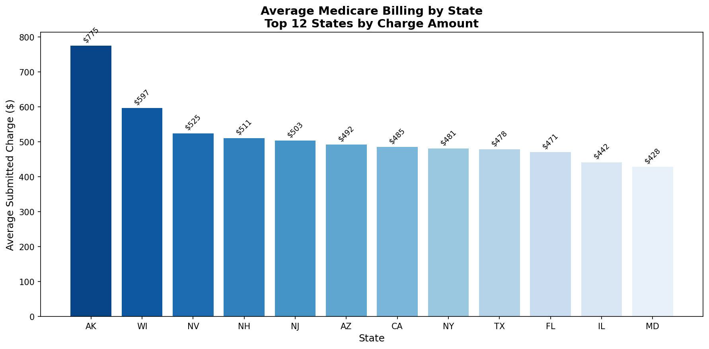
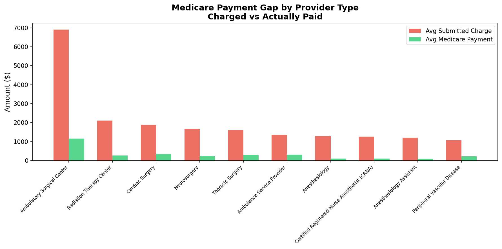

# 🏥 Healthcare Claims Anomaly Analysis
### Medicare Billing Anomaly Detection using SQL + Python


---

## 📋 Business Problem

Medicare billing fraud and anomalies cost the US healthcare 
system billions annually. As a Technical Business Analyst in 
Healthcare IT, detecting providers with abnormal billing patterns 
is critical to claims processing integrity.

This project analyzes **9,660,647 real Medicare claims records** 
to identify billing anomalies, payment gaps, and geographic 
patterns using SQL window functions and Python visualization.

---

## 🔍 Key Findings

- 🚨 **Most Extreme Anomaly:** A Diagnostic Radiology provider in NY 
  charged **$99,999** vs specialty average of **$1,995** — 
  **50x above normal**
- 💰 **Biggest Payment Gap:** Ambulatory Surgical Centers charge 
  **$6,905** on average but Medicare only pays **$1,164** — 
  a gap of **$5,741 per claim**
- 🗺️ **Geographic Hotspot:** Alaska shows the highest average 
  charge at **$775** among standard US states
- 📊 **Most Billed Service:** Ground ambulance mileage with 
  **99 million+** total services nationwide

---

## 🛠️ Tools & Technologies

| Tool | Purpose |
|---|---|
| Python (Pandas) | Data loading, cleaning, transformation |
| SQLite (via Python) | SQL queries on 9.6M records |
| Matplotlib + Seaborn | Data visualization |
| SQL Window Functions | Anomaly detection (PARTITION BY) |
| CMS Medicare Dataset | Public healthcare data source |

---

## 📊 Visualizations

### 1. Top 10 Highest Charging Provider Types


### 2. Billing Anomaly Detection


### 3. State Level Charges


### 4. Medicare Payment Gap


---

## 🗄️ SQL Highlights

### Anomaly Detection using Window Functions
```sql
SELECT 
    Provider_Type,
    Last_Name,
    Avg_Submitted_Charge as Provider_Charge,
    AVG(Avg_Submitted_Charge) OVER (PARTITION BY Provider_Type) as Specialty_Avg,
    Avg_Submitted_Charge / AVG(Avg_Submitted_Charge) 
        OVER (PARTITION BY Provider_Type) as Charge_Ratio
FROM medicare_claims
ORDER BY Charge_Ratio DESC
```

### Payment Gap Analysis
```sql
SELECT 
    Provider_Type,
    AVG(Avg_Submitted_Charge) as Avg_Charge,
    AVG(Avg_Medicare_Payment) as Avg_Paid,
    AVG(Avg_Submitted_Charge) - AVG(Avg_Medicare_Payment) as Gap
FROM medicare_claims
GROUP BY Provider_Type
ORDER BY Gap DESC
```

---

## 💼 Business Relevance

This project directly mirrors real-world Healthcare IT BA work:
- Claims anomaly detection for fraud prevention
- Provider billing pattern analysis
- Geographic cost variation reporting
- Medicare payment reconciliation

---

## 📁 Project Structure
healthcare-claims-project/
├── data/
│   └── medicare_data.csv        # CMS Medicare public dataset
├── sql/
│   └── queries.sql              # All SQL queries used
├── notebooks/
│   └── analysis.ipynb           # Full analysis notebook
├── visuals/
│   ├── top_provider_charges.png
│   ├── billing_anomalies.png
│   ├── state_charges.png
│   └── medicare_payment_gap.png
└── README.md

---

## 📂 Data Source

[CMS Medicare Physician & Other Practitioners Dataset](https://data.cms.gov/provider-summary-by-type-of-service/medicare-physician-other-practitioners/medicare-physician-other-practitioners-by-provider-and-service/data)
— Publicly available, updated annually by Centers for Medicare & Medicaid Services

---

*Built by Bhanu Mudireddy — Technical Business Analyst | Healthcare IT*  
*[LinkedIn](https://linkedin.com/in/bhanu-mudireddy)*